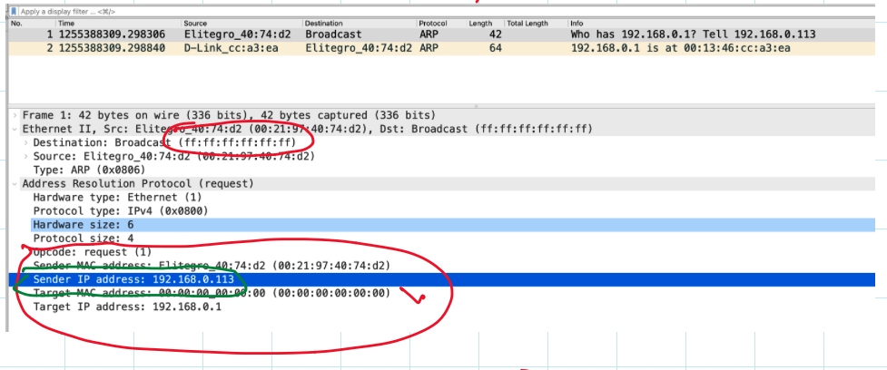
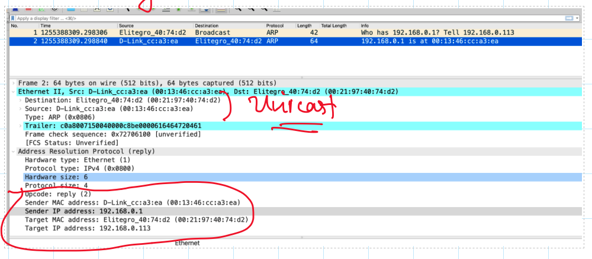
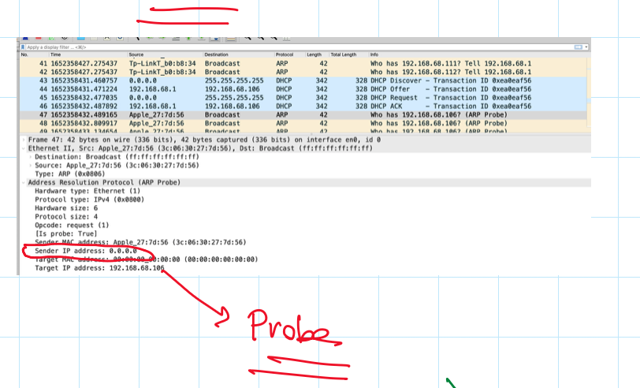
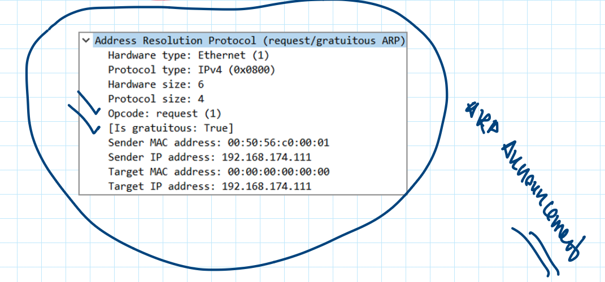
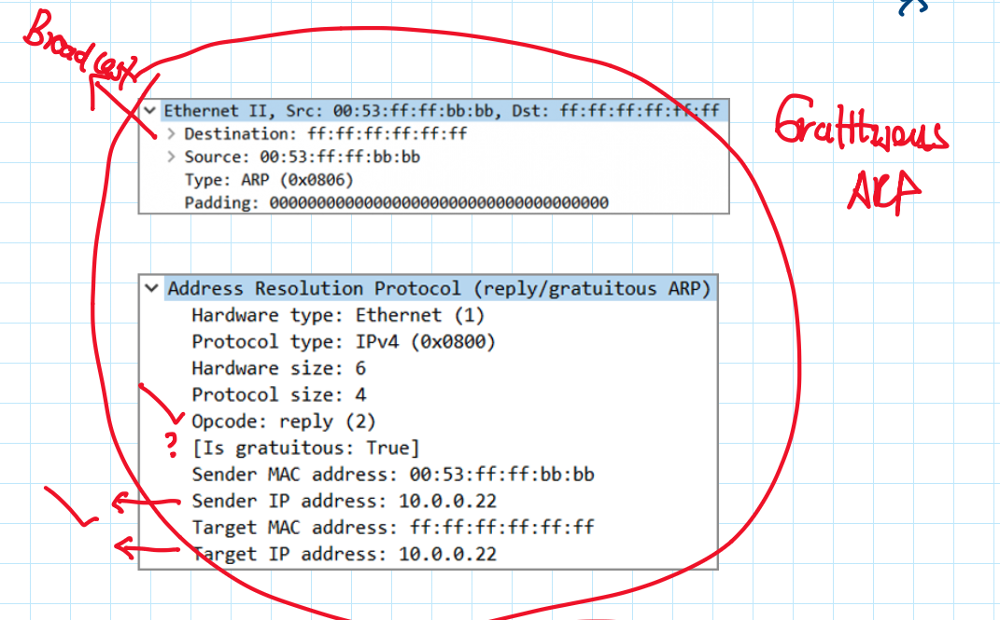

# ARP Packet Types

Address Resolution Protocol (ARP) is a protocol used to map an IP address to a physical MAC (Media Access Control) address on a local network. There are different type of ARP packet types:

## ARP Request

   An ARP Request is a **broadcast** packet sent by a device on the network that needs to find the MAC address corresponding to a given IP address. The ARP Request packet contains the IP address of the target device that the sender wants to communicate with but lacks its MAC address. When the target device receives this request, it will respond with an ARP Reply.

   

## ARP Reply

   An ARP Reply is a **unicast** packet sent by a device in response to an ARP Request. It contains the MAC address that corresponds to the IP address queried in the ARP Request. The device that sent the ARP Request uses this information to update its ARP cache, allowing it to communicate directly with the target device using its MAC address.

   

##  ARP Probe

   An ARP Probe is a special type of ARP Request used to determine if an IP address is already in use on the network. When a device is configured with a new IP address, it may send an ARP Probe (three times) as a **broadcast** packet asking if any other device on the network is already using that IP address. If there is no response to the ARP Probe, it means the IP address is not in use, and the device can safely assign that IP address to itself. ARP Probes are commonly used during the IP address configuration process, especially in the context of duplicate IP address detection.

   

##  ARP Announcement

   An ARP Announcement is a variation of the ARP Probe. After a device has successfully configured its IP address (e.g., after receiving no response to its ARP Probes for a specific IP), it can send an ARP Announcement to the network. The Announcement is a **broadcast** packet that informs other devices on the network about its **IP-to-MAC address mapping** (IP address change). This way, other devices can update their ARP caches accordingly, ensuring proper communication with the newly configured device.

   

##  Gratuitous ARP

   A Gratuitous ARP is a special ARP packet where a device sends an ARP Reply for its own IP address, even if no ARP Request was made for that IP. It is sent as a **broadcast** packet to all devices on the local network. **The main purpose of a Gratuitous ARP is to update other devices ARP caches with the MAC address of the sender** . It can serve various purposes, such as IP conflict detection, cache flushing, or quickly updating other devices after an interface or IP address change.

   

##  Gratuitous ARP and HSRP (Next Hop Protocols)

Gratuitous ARP is used in HSRP failover scenarios. When an HSRP group experiences a failover event, the new active router (the one that takes over the role of the failed active router) sends Gratuitous ARP packets to the network.

The purpose of the Gratuitous ARP packets in HSRP failover is to quickly update the ARP caches of other devices on the network with the MAC address of the new active router associated with the virtual IP address. By doing so, other devices learn the new MAC address mapping and can start forwarding traffic to the new active router without interruption.

Here's how it works during HSRP failover:

1. Failover Occurs: The active router in the HSRP group experiences a failure or becomes unreachable, triggering a failover event.

2. New Active Router Elected: The standby router with the highest priority or preempt capability is elected as the new active router to take over the virtual IP address.

3. Gratuitous ARP Sent: The new active router sends out one or more Gratuitous ARP packets. These ARP packets contain the virtual IP address as both the source and destination IP address and the MAC address of the new active router as the source MAC address. This informs other devices on the network that the MAC address for the virtual IP has changed and is now associated with the new active router.

4. ARP Cache Update: Other devices on the network, upon receiving the Gratuitous ARP packets, update their ARP caches with the new MAC address for the virtual IP address. This ensures that traffic intended for the virtual IP address is now directed to the new active router.

By using Gratuitous ARP, HSRP failover achieves a rapid and seamless transition between active and standby routers, minimizing downtime and providing continuous network connectivity. Devices on the network do not need to wait for ARP cache timeouts to update their entries, as the Gratuitous ARP packets trigger an immediate update to the new MAC address mapping.

When using an HSRP (Hot Standby Router Protocol) router as a default gateway, the ARP mapping that a device holds in its ARP cache is **"virtual IP address -> Active Router MAC address."**

The virtual IP address is the IP address associated with the HSRP group, and it's used as the default gateway IP address for devices on the local network. **The virtual MAC address**, which is a well-known and shared virtual MAC address, is used only in HSRP communication between the routers, not in normal data forwarding.

##  Teaming / Clusters / Next-Hop Resolution Protocols (HSRP/VRRP/GLBP)

Image is given as a remainder to the instructor. Should be updated.

