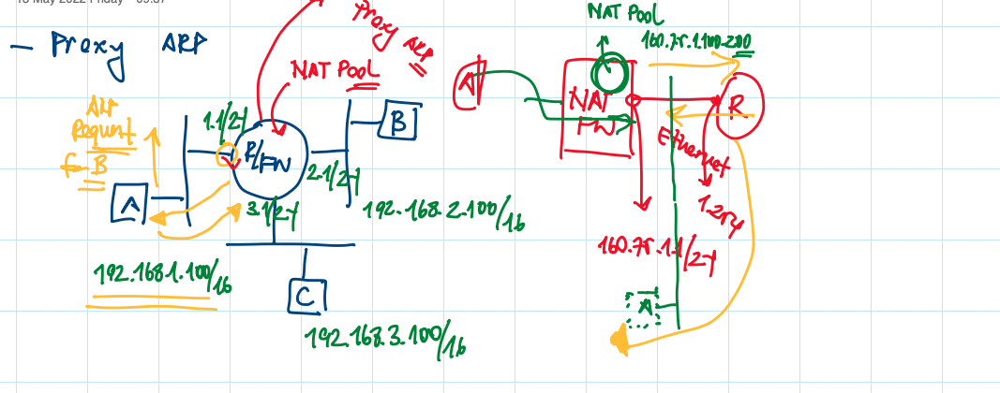
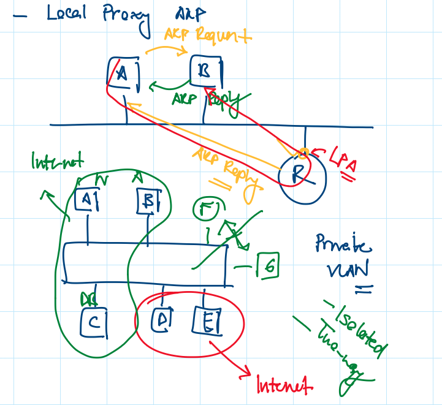
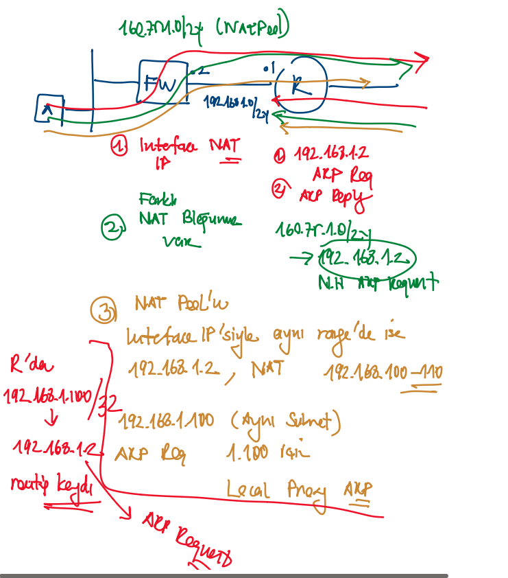

# Proxy ARP vs. Local Proxy ARP

When proxy ARP is disabled, the networking device responds to ARP requests received on an interface only if one of the following conditions is met:

- The target IP address in the ARP request is the same as the interface IP address on which the request is received.

- The target IP address in the ARP request has a statically configured ARP alias.

When proxy ARP is enabled, the networking device also responds to ARP requests that meet all the following conditions:

- The target IP address is not on the same physical network (LAN) on which the request is received.

- The networking device has one or more routes to the target IP address.

- All of the routes to the target IP address go through interfaces other than the one on which the request is received.

When local proxy ARP is enabled, the networking device responds to ARP requests that meet all the following conditions:

- The target IP address in the ARP request, the IP address of the ARP source, and the IP address of the interface on which the ARP request is received are on the same Layer 3 network.

- The next hop for the target IP address is through the same interface as the request is received.

Typically, local proxy ARP is used to resolve MAC addresses to IP addresses in the same Layer 3 network. Local proxy ARP supports all types of interfaces supported by ARP and unnumbered interfaces.

[Document Link for Proxy ARP](https://www.cisco.com/c/en/us/support/docs/ip/dynamic-address-allocation-resolution/13718-5.html)

## NAT process and Proxy ARP

