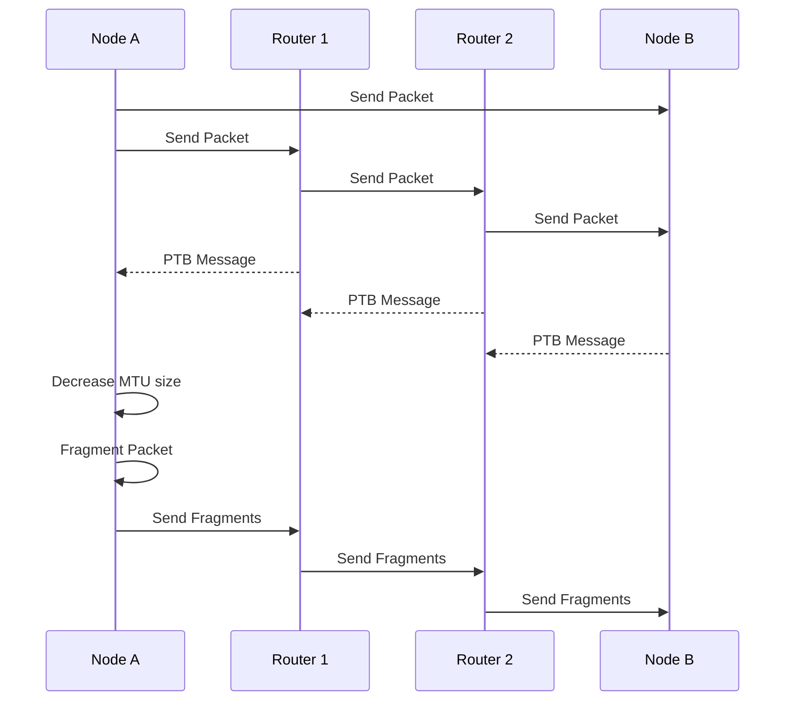

# IPv6 Protocol

## How does a IPv6 node decide whether to fragment the packet or not?

In IPv6, the source node is responsible for fragmenting packets before transmission. When a node sends a packet, it first checks the Path MTU (PMTU) of the destination network, which is the maximum size of the packet that can be transmitted without fragmentation. The PMTU can be determined through the use of the Path MTU Discovery (PMTUD) mechanism, which involves sending packets with varying sizes and monitoring for any Packet Too Big (PTB) messages from routers along the path.

If the packet size exceeds the PMTU, the source node will fragment the packet into smaller packets and assign a unique identification number to each fragment. The fragmentation process adds a Fragment Header to each fragment, which includes the fragmentation identification number, an offset value indicating the position of the fragment in the original packet, and a flag indicating whether more fragments are expected.

If the packet size does not exceed the PMTU, the source node will send the packet without fragmentation. This helps to minimize the use of network resources and improve network efficiency.

It is worth noting that while IPv6 fragmentation is less common than in IPv4, it is still possible and can occur in cases where PMTUD is not successful or when a node purposely chooses to send packets larger than the PMTU.

### Sample Flowchart (needs editing)

